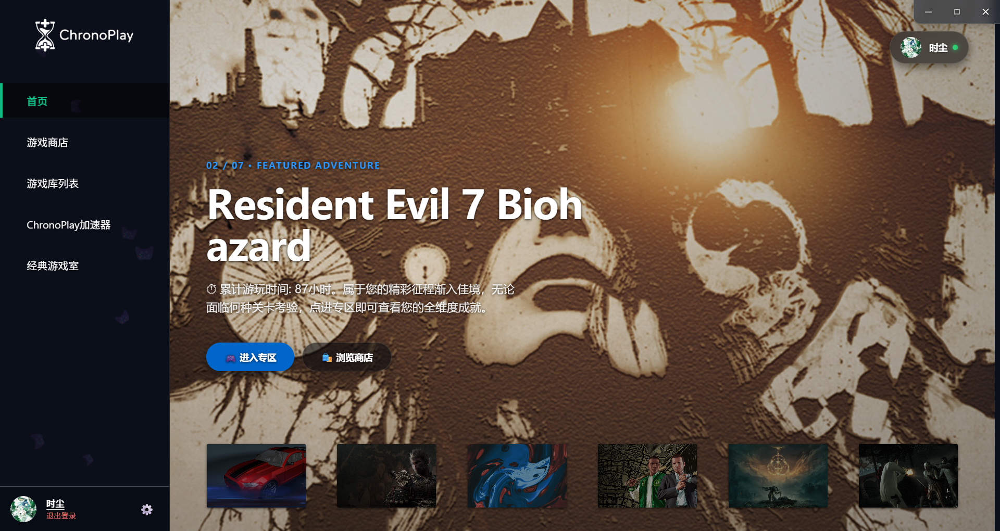
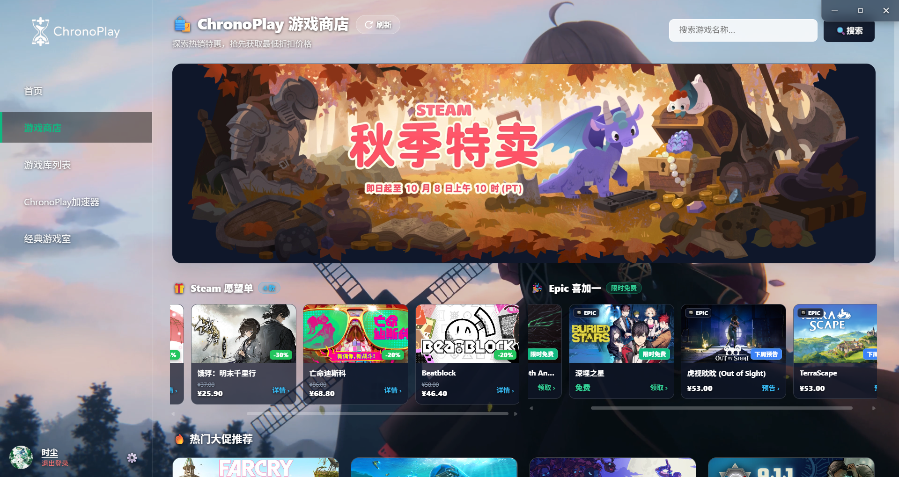
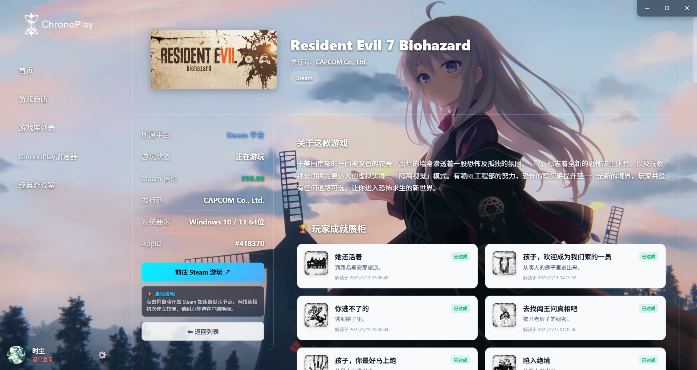
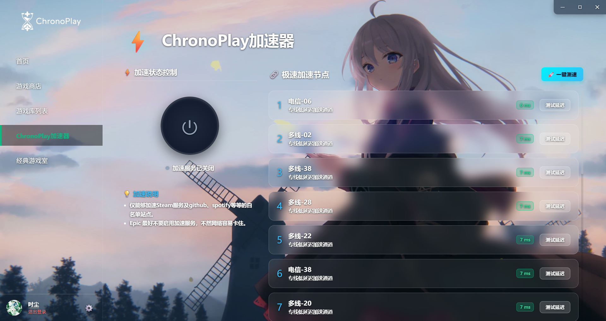
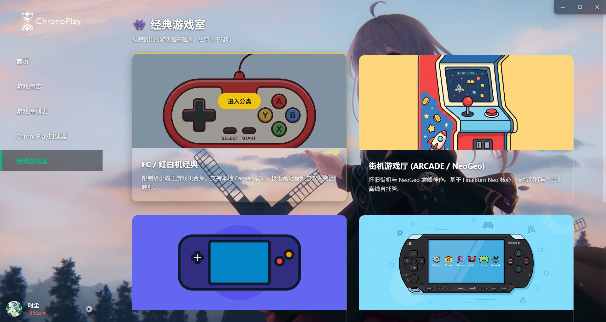
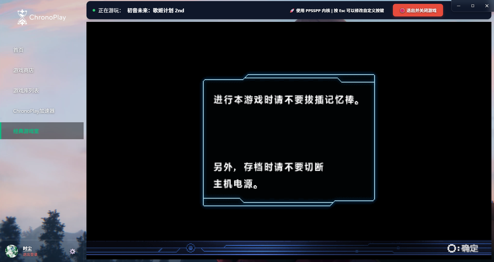
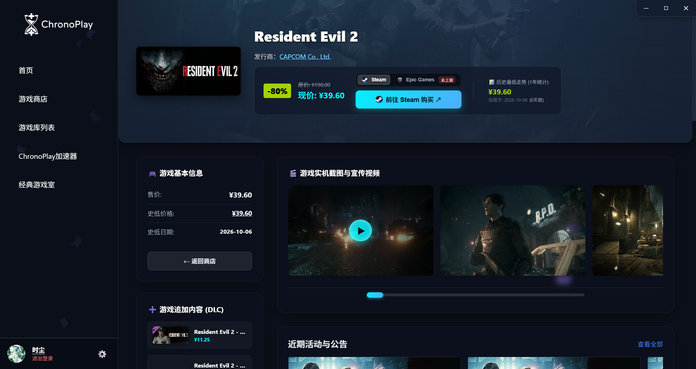
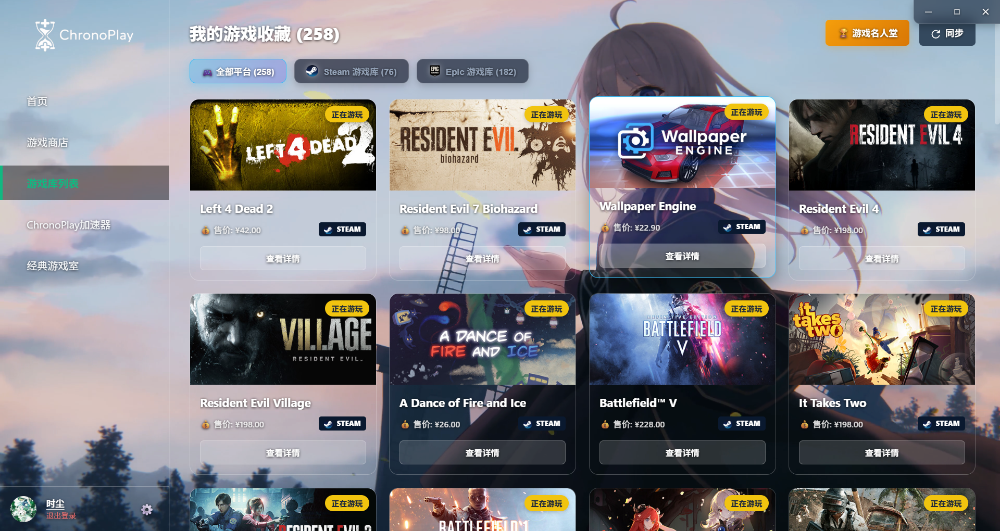
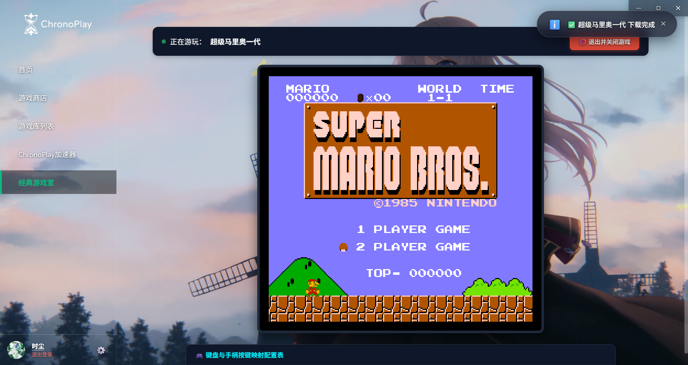

<div align="center">

# 🎮 ChronoPlay 游戏中心

**专为玩家打造的高颜值全能游戏库与复古游戏娱乐桌面客户端**

[](https://github.com/shichen1234/ChronoPlay)
[](https://www.electronjs.org/)
[](https://vuejs.org/)
[](https://vitejs.dev/)
[](https://www.microsoft.com/windows)
[](LICENSE)

</div>

---

## 📖 项目简介

**ChronoPlay** 是一款基于 **Vue 3 + Vite + Electron** 架构开发的现代化游戏聚合桌面应用。集 **多平台游戏库管理、Steam 史低行情监测、专属网络加速器、WebAssembly 复古模拟器厅** 于一体，提供沉浸式毛玻璃暗黑视觉与极致流畅的原生体验。

---

## ✨ 功能界面导览

### 01. 🏠 沉浸式首页大厅
> 动态大作焦点海报轮播，沉浸式暗黑毛玻璃质感，一键快速进入游戏专区与特惠商城。



---

### 02. 🛍️ 游戏特惠商店
> 实时聚合 Steam 官方大促与精选特惠，集成个人愿望单降价通知与 Epic 喜加一限免速递。



---

### 03. 🏆 游戏专区与成就展柜
> 完整收录游戏运行状态、系统配置要求与背景资料，原生嵌入玩家专属成就解锁展柜。



---

### 04. ⚡ ChronoPlay 网络加速器
> 内置 20+ 极速专线节点，支持一键实时低延迟测速，全方位加速 Steam 商店、社区与游戏服务。



---

### 05. 🕹️ 经典复古游戏室
> 集成 FC 红白机、街机 (Arcade / NeoGeo)、GBA 掌机与 PSP 经典分类，即点即玩无需复杂配置。



---

### 06. 🎮 PSP 掌机高清模拟
> 采用 PPSSPP WebAssembly 3D 渲染核心，全屏流畅运行，支持自定义键位与手柄映射。



---

### 07. 📉 史低价格走势与商品详情
> 智能分析历史 1 年最低价格走势曲线，提供实机演示视频、高清截图画廊与 DLC 拓展包清单。



---

### 08. 📚 跨平台游戏统一收藏库
> Steam 与 Epic Games 双平台游戏自动聚合，支持分类筛选、游玩状态标识与一键云端同步。



---

### 09. 🍄 FC 红白机经典畅玩
> 基于 JSNES 高保真核心，在线秒级拉取经典 ROM，内置手柄/键盘双人键位映射方案。



---

### 10. 👤 个人中心与多平台互联
> 支持绑定 Steam 与 Epic Games 账号，资产实时互通同步，内置账号安全设置与个性化管理。


---

## 🛠️ 技术架构

| 模块 | 技术选型 | 说明 |
| :--- | :--- | :--- |
| **前端架构** | Vue 3 + Vite + Pinia + Vue Router | 响应式状态管理与高效路由 |
| **视觉与交互** | Modern CSS + ECharts | 暗黑拟物毛玻璃风格，图表可视化分析 |
| **后端服务** | Node.js + Express + Axios | 本地代理、数据解析与安全 API 调用 |
| **模拟器引擎** | WebAssembly (PPSSPP / FBNeo / JSNES / mGBA) | 纯浏览器端高性能离线自托管核心 |
| **桌面包装** | Electron 43 + Inno Setup | Windows 原生窗口、系统托盘与安装包编译 |

---

## 📁 目录结构

```text
ChronoPlay/
├── tupian/                # README 界面截图资源 (1.png ~ 10.png)
├── public/                # 静态文件、游戏 ROM 与矢量封面
│   └── emulatorjs/        # WebAssembly 模拟器引擎资源
├── src/                   # Vue 3 前端工程源码
│   ├── assets/            # 全局样式与静态图标
│   ├── views/             # 视图页面 (首页、商店、游戏库、加速器、模拟器)
│   └── store/             # Pinia 状态管理
├── server/                # Express 本地后端服务与代理
├── electron-main.js       # Electron 主进程生命周期管理
├── installer.iss          # Inno Setup 一键安装包配置脚本
└── package.json           # 项目依赖与构建指令
```

### 环境依赖
- [Node.js](https://nodejs.org/) (推荐 v18 及以上)
- Windows 10 / 11 操作系统


## 📜 开源协议

本项目采用 [MIT License](LICENSE) 开源许可，欢迎体验、交流与二次开发。
